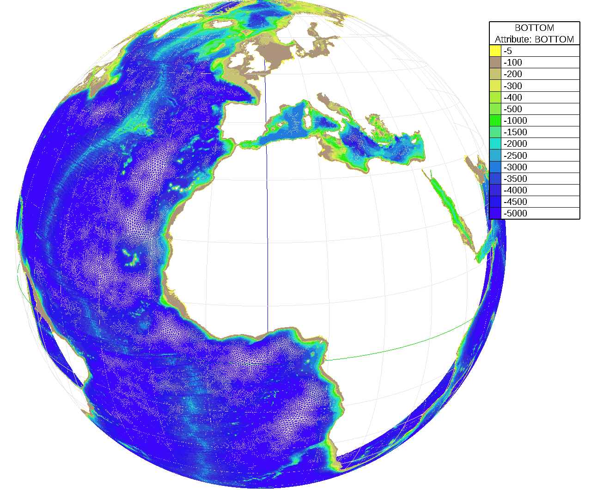

# Seareport Models
Concept: Build reproducible models in 3 steps:
 1. `mesh`: reproduce the meshing
 2. `model`: reproduce the model
 3. `results`: reproduce the results data extraction (2D and 1D Time Series)

Example: Using `scripts/model_v2.2.py`, you can produce this 3km global mesh and model metocean data


## current meshes/models available

| Mesh version | mesher used| resolution | hole in the north pole | bathy gradient | other              | model application |
|--------------|------------|------------|------------------------|----------------|--------------------|-------------------|
| `v0.0`       | oceanmesh  | 50km       |         :x:            |      yes       |         -          |        2D         |
| `v0.1`       | oceanmesh  | 20km       |         :x:            |      yes       |         -          |        2D         |
| `v0.2`       | oceanmesh  | 20km       |         :x:            |      yes       |  max depth at -20m |        2D         |
| `v0.3`       | oceanmesh  | 20km       |         yes            |      :x:       |         -          |      waves        |
| `v0.4`       | oceanmesh  | 20km       |         yes            |      yes       |         -          |        3D         |
| `v1.2`       | oceanmesh  | 6km        |         :x:            |      yes       |         -          |        2D         |
| `v1.3`       | oceanmesh  | 6km        |         yes            |      :x:       |         -          |      waves        |
| `v1.4`       | oceanmesh  | 6km        |         yes            |      yes       |         -          |        3D         |
| `v1.5`       | JIGSAW     | 6km        |         yes            |      yes       |         -          |        2D         |
| `v2.2`       | oceanmesh  | 3km        |         :x:            |      yes       |         -          |        2D         |
| `v2.3`       | JIGSAW     | 3km        |         :x:            |      yes       |         -          |        2D         |
| `v3.1`       | JIGSAW     | 1km        |         :x:            |      yes       |         -          |        2D         |

## Install
first build the binaries: 
```
cd v0.0
mamba env create -n v0 -f binary-om-telemac-openmpi-p3.11.yml
```

then build the correct python libraries 
```
python -mvenv .venv
source .venv/bin/activate
poetry install
```
then run the meshing script: 
```
cd ..
python scripts/mesh_v0.0.py
```

## Mesh, model and/or export results
By default, all 3 steps are activated, to deactivate meshing:

change:
```python
if __name__ == "__main__":
    main()
```
into:
```python
if __name__ == "__main__":
    main(mesh = False)
```

in `scripts/mesh_v0.0.py`